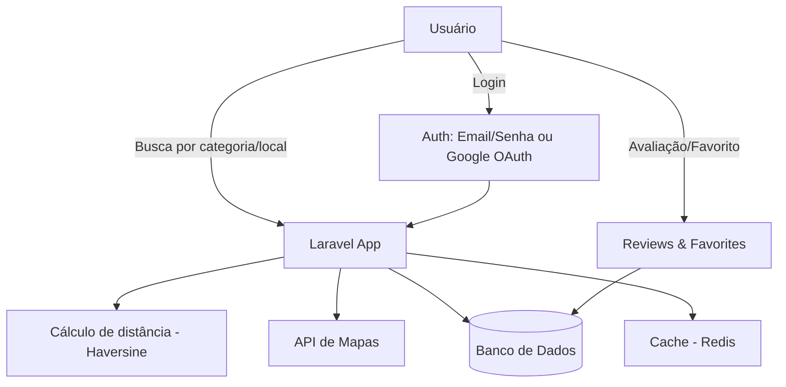

# 📍 CadeAi

> Sistema web para busca de estabelecimentos por proximidade — lanchonetes, petshops, farmácias, supermercados e mais.

> ⚠️ **Nota:** este é um repositório de apresentação. O código-fonte é privado; aqui você encontra a documentação do projeto, decisões técnicas e demonstração visual.

---

## 🎯 Sobre o projeto

O **CadeAi** nasceu de um problema simples do dia a dia: encontrar rápido o que você precisa perto de você, sem precisar comparar três apps diferentes. O sistema permite buscar estabelecimentos por categoria e proximidade geográfica, exibindo resultados num mapa interativo com avaliações reais de outros usuários.

**Principais funcionalidades:**
- 🔍 Busca por categoria (lanchonete, petshop, farmácia, supermercado, etc.) e raio de distância
- 🗺️ Mapa interativo com marcadores customizados por categoria
- ⭐ Sistema de avaliações (nota + comentário) com cálculo de média em tempo real
- ❤️ Favoritos salvos por usuário autenticado
- 🔐 Login por e-mail/senha ou via Google (OAuth2)
- 🛡️ Rate limiting, proteção contra spam e políticas de autorização por usuário

---

## 🖼️ Demonstração

| Tela de busca | Mapa interativo | Perfil e favoritos |
|:---:|:---:|:---:|

---

## 🏗️ Arquitetura

---

## ⚙️ Stack técnica

| Camada | Tecnologia |
|---|---|
| Backend | Laravel 11 (PHP 8.2+) |
| Banco de dados | MySQL |
| Frontend | Blade + Alpine.js |
| Autenticação | Laravel Breeze + Socialite (Google OAuth) |
| Mapas | Google Maps Platform / Leaflet |
| Cache | Redis |
| Testes | PHPUnit / Pest |

---

## 🧠 Decisões técnicas e desafios

**Busca por proximidade geográfica**
Implementei o cálculo de distância direto na query SQL usando a fórmula de Haversine, evitando trazer todos os registros pra memória e filtrar em PHP — importante pra performance conforme a base de estabelecimentos cresce.

**Segurança em avaliações**
Como qualquer usuário autenticado pode avaliar um local, precisei limitar a frequência de avaliações por usuário (rate limiting), sanitizar comentários contra XSS e garantir via Policies que cada um só edite as próprias avaliações.

**Autenticação flexível**
Além do login tradicional, integrei OAuth2 com Google via Laravel Socialite, unificando contas pelo e-mail quando o usuário já tinha cadastro prévio.

**Cache de buscas frequentes**
Buscas populares (ex: "farmácia" numa região específica) são cacheadas por poucos minutos no Redis, reduzindo carga no banco em picos de acesso.

---

## 📌 Status do projeto

🚧 Em desenvolvimento ativo — testando com um grupo reduzido de usuários antes de expandir.

---

## 📫 Contato

Ficou com alguma dúvida técnica sobre o projeto ou quer trocar uma ideia? Me chama:

- LinkedIn: www.linkedin.com/in/karlysonf
- E-mail: karlysonsantosdev@gmail.com
